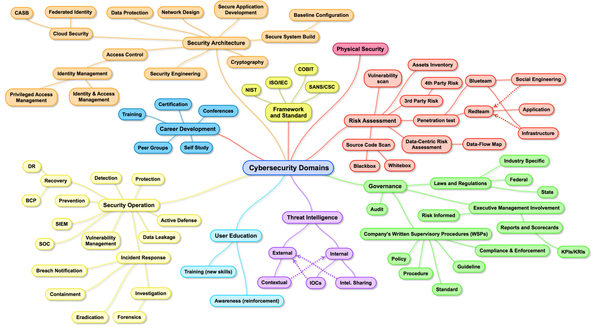

# Phase 3: Cyber Security fundamentals

Cybersecurity is the overall umbrella term. It involves securing everything, including the network, but also the devices and data. So its essential to protect all the three. i.e, network, devices and data from the attacker/hacker.

## Resources & Things you should be able familiar with at the end of this phase 

| Topic      | 
| :------------- | 
| [CIA Triad](https://www.fortinet.com/resources/cyberglossary/cia-triad) | 
| [Exploit](https://www.cisco.com/c/en/us/products/security/advanced-malware-protection/what-is-exploit.html) | 
| [Risk, Vulnerability & Threat](https://www.kennasecurity.com/blog/risk-vs-threat-vs-vulnerability/) | 
| [Types of malware](https://www.crowdstrike.com/cybersecurity-101/malware/types-of-malware/) | 
| [Types of cyber attacks](https://www.fortinet.com/resources/cyberglossary/types-of-cyber-attacks	) | 
| [Network sniffing](https://www.lifewire.com/definition-of-sniffer-817996	) | 
| [ARP Poisoning](https://www.imperva.com/learn/application-security/arp-spoofing/) | 
| [Types of Security](https://cyberthreatportal.com/types-of-computer-security/	) | 
| [Crypotography](https://www.elprocus.com/cryptography-and-its-concepts/	) | 
| [Cloud Cryptography](https://www.geeksforgeeks.org/an-overview-of-cloud-cryptography/) | 
| [Antivirus](https://softwarelab.org/what-is-antivirus-software/	) | 
| [2FA](https://authy.com/what-is-2fa/	) |
| [IOC & IOA](https://www.crowdstrike.com/cybersecurity-101/indicators-of-compromise/ioa-vs-ioc/) | 
| [Threat Intelligence](https://www.crowdstrike.com/cybersecurity-101/threat-intelligence/) | 
| [EDR](https://www.crowdstrike.com/cybersecurity-101/endpoint-security/endpoint-detection-and-response-edr/) | 
| [XDR](https://www.crowdstrike.com/cybersecurity-101/what-is-xdr/) | 
| [MDR](https://www.crowdstrike.com/cybersecurity-101/managed-detection-and-response-mdr/) | 
| [Intrusion Detection systems (IDS)](https://www.geeksforgeeks.org/intrusion-detection-system-ids	) | 
| [Intrusion Prevention systems (IPS)](https://www.geeksforgeeks.org/intrusion-prevention-system-ips/	) | 
| [Data Loss prevention](https://www.imperva.com/learn/data-security/data-loss-prevention-dlp/) | 
| [Cloud Security](https://www.ibm.com/in-en/topics/cloud-security	) | 
| [Email Gateway](https://expertinsights.com/insights/what-are-email-security-gateways-how-do-they-work-and-what-can-they-offer-your-organization/	) | 
| [SPF, DKIM, DMARC](https://www.compassitc.com/blog/what-are-dkim-spf-and-dmarc) | 
| [Log analysis](https://www.vmware.com/topics/glossary/content/log-analysis.html) | 
| [Windows Event Viewer](https://www.howtogeek.com/123646/htg-explains-what-the-windows-event-viewer-is-and-how-you-can-use-it/	) | 
| [Windows Registry](https://www.lifewire.com/windows-registry-2625992) | 
| [Asset Discovery Tool](https://www.tek-tools.com/itsm/it-asset-discovery) | 
| [Security Information and Event Management (SIEM)](https://www.imperva.com/learn/application-security/siem/	) | 
| [User Entity Behavior Analysis (UEBA)](https://digitalguardian.com/blog/what-user-and-entity-behavior-analytics-definition-ueba-benefits-how-it-works-and-more) | 
| [Security Orchestration Automation Response (SOAR)](https://www.fireeye.com/products/helix/what-is-soar.html) | 
| [Playbook, Runbook](https://shoreline.io/blog/runbooks-vs-playbooks	) | 
| [NIST Framework for Cyber Security](https://www.balbix.com/insights/nist-cybersecurity-framework/	) | 
| [GDPR Policy](https://www.itgovernance.eu/blog/en/summary-of-the-gdprs-10-key-requirements		) | 
| [Incident management life cycle](https://www.cynet.com/incident-response/nist-incident-response/	) | 
| [Mitre Framework](https://www.mcafee.com/enterprise/en-in/security-awareness/cybersecurity/what-is-mitre-attack-framework.html) | 
| [Threat Management](https://www.ibm.com/in-en/topics/threat-management) | 
| [Malware analysis](https://www.crowdstrike.com/cybersecurity-101/malware/malware-analysis/) | 
| [Yara rule](https://virustotal.github.io/yara/) | 
| [Top 10 Open Web Application Security Project (OWASP)](https://www.hacksplaining.com/owasp	) | 
| [Threat Hunting](https://www.crowdstrike.com/cybersecurity-101/threat-hunting/	) | 
| [Honeypot](https://www.techtarget.com/searchsecurity/definition/honey-pot	) | 
| [Smoke screen](https://blog.radware.com/security/2015/12/how-smoke-screen-cyber-attacks-are-being-used/	) | 
| [Penetration Testing : Reference 1](https://www.imperva.com/learn/application-security/penetration-testing/) | 
| [Penetration Testing : Reference 2](https://www.coresecurity.com/penetration-testing	) |
| [Vulnerability assessment](https://www.imperva.com/learn/application-security/vulnerability-assessment/	) | 
| [Threat model analysis (TMA)](https://www.synopsys.com/glossary/what-is-threat-modeling.html		) | 
| [PCAP Analysis](https://resources.infosecinstitute.com/topic/pcap-analysis-basics-with-wireshark/) | 
| [Ethical Hacking](https://www.synopsys.com/glossary/what-is-ethical-hacking.html	) | 
| [What is SOC](https://www.exabeam.com/security-operations-center/security-operations-center-a-quick-start-guide/) | 
| [SOC Tools](https://www.exabeam.com/explainers/siem/the-soc-secops-and-siem/) | 
| [SOC Roles and Responsibilities](https://www.exabeam.com/security-operations-center/security-operations-center-roles-and-responsibilities/) | 
| [SOC 1 and SOC 2 Audit](https://www.strongdm.com/blog/soc-1-vs-soc-2	) | 
| [TryHackMe.com : One of the best interactive way to learn](https://tryhackme.com/paths) | 
| [Python automations (Optional)](https://automatetheboringstuff.com/) | 
| [Virtualization and Containerization (Optional)](https://www.baeldung.com/cs/virtualization-vs-containerization) | 

## Certifications you might want to look into

There are TONS of Cyber Security certifications out there. If you did want to get one, take a look at the [Comptia Security+](https://www.comptia.org/certifications/security) or [EC-Council: Certified Ethical Hacker](https://www.eccouncil.org/programs/certified-ethical-hacker-ceh/) which are pretty much industry standard.

At the end of the day, if you want to take them, go for it :)
  
## What's next

This is the end of Cyber Security Basics. And we will continuously keep on adding/updating the resourses. We hope the above topics will give you enough knowledge and confident about cyber security and now, you can go and apply for security related jobs. All the best for your job search!

### [Go to Phase 4: Cloud Security (Optional)](../phase4/README.md)

But, If you need to explore more resources or more hands-on Training related to Cyber Security, [click here](../Additional/README.md)

Check sidebar for more content!

[Go back to homepage](../README.md)

___

Note: In Resources section, you will leave this domain by accesing the links provided for references. Beware of external sites asking for your personal information (e.g. phone numbers, credit cards). You may become a victim of a phishing attack! We are not responsible for any such incidents.
